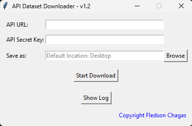

# API Dataset Downloader 📥

 

This is a graphical user interface (GUI) utility built using **Python** and **Tkinter** to download datasets from APIs and save them to a user-specified location.

So far, it has been tested and successfully used with the API: https://api.stats.govt.nz/ using the http method.

## 🌟 Features

- 🔗 User-friendly graphical interface to input API URL and Secret Key.
- ✅ API key validation.
- 📁 Option to choose save location.
- 📊 Downloads data sets and organizes them into folders.
- ⏳ Displays a progress bar and a log section.
- 🗃️ Saves the data sets in a zip file after downloading.

## 🚀 How to Use

1. Open the program.
2. Enter the API URL and the Secret Key in the provided fields.
3. Choose the save location or use the default (Desktop).
4. Click on "Start Download" to initiate the download process.
5. Progress will be displayed in the progress bar.
6. Upon completion, all downloaded datasets will be compressed into a zip file in the chosen save location.

## 🛠️ Dependencies

- Python 3.7+
- `requests`
- `pandas`
- `tkinter`

To install the dependencies, run: pip install requests pandas

## 🖋️ About the Author

This project was created by **Fledson Chagas**. To learn more about my work and experiences, connect with me on LinkedIn!

